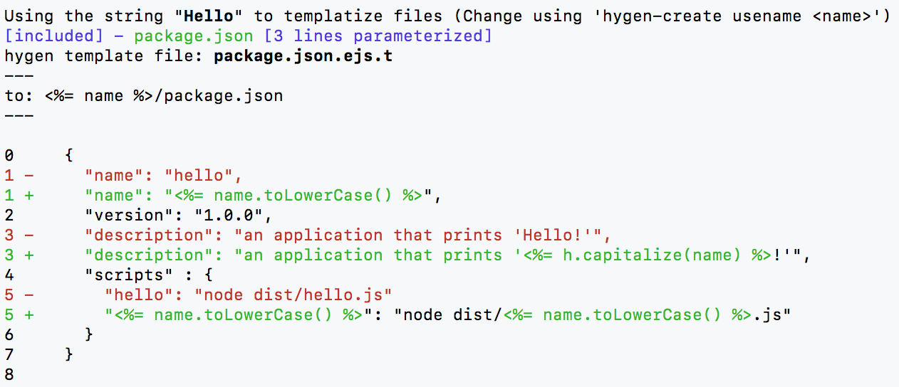

# hygen-create
Simplifies creation of [hygen](http://www.hygen.io) templates from existing projects

## Why

Because creating templates from existing projects is annoying

## In a nutshell

`hygen-create` takes a set of existing project files and uses them to create
`hygen` template files, replacing a selected word with appropriate <%= name %> (or <%= h.capitalize(name) %>) entries.

The resulting template files can be used as is (using the `hygen <generator> new` command - assuming [hygen](http://www.hygen.io) is installed).  They can also be manually edited and changed as desired.


## Installation

This is still work in progress, so not available on npm yet. 

To work with this, clone the repository and run:

```
$ cd hygen-create
$ yarn link
$ yarn
```

This should make the `hygen-create` command available.


## Generating a generator

There are several steps to generating a generator:

1. Start a hygen-create session: `hygen-create start <generator-name>`
1. Choose files to templatize:  `hygen-create add <file>...`
1. Indicate which word to replace with <%= name %> placeholders: `hygen-create usename <name>`
1. (Optionally) view information about replacements to be made: `hygen-create status`
1. Specify target _templates folder: `export hygen-create_TMPLS=<path>`
1. Initiate generation: `hygen-create generate`

## Example session

Just to give a sense of how `hygen-create` works, let's suppose we have a small project that we'd like to reuse as a starting point for other projects.

Our directory hierarchy is:

```
/projects/hello
 |-package.json
 |-dist
    |-hello.js
```

The contents of `package.json`:

```json
{
  "name": "hello",
  "version": "1.0.0",
  "description": "an application that prints hello",
  "scripts" : {
    "hello": "node dist/hello.js"
  }
}
```

The contents of `dist/hello.js`:

```js
// This is hello.js
console.log("Hello!")
```

Although quite simple (and frankly, useless), this is a fully-functioning package 
and we can run the `hello` script by typing `npm run hello`:

```bash
$ npm run hello

> hello@1.0.0 hello /example
> node dist/hello.js

Hello!
```

Let's now use `hygen-create` to generate a `greeter generator` from this project.

We'll first start a `hygen-create` session:
```
$ hygen-create start greeter
created hygen-create.json
```

Now let's add our files:

```
$ hygen-create add package.json dist/hello.js 
adding:  package.json
adding:  dist/hello.js
```

If we take a look at `hygen-create.json`, we'll see the added files are listed there:

```
$ cat hygen-create.json 
{
  "about": "This is a hygen-create definitions file. The hygen-create utility creates generators that can be executed using hygen.",
  "hygen_create_version": "0.1.0",
  "name": "greeter",
  "files_and_dirs": {
    "hygen-create.json": true,
    "package.json": true,
    "dist/hello.js": true
  },
  "templatize_using_name": null
}
```

You might notice that `hygen-create` automatically added `hygen-create.json` even though
we did not add it explicitly.  The addition of `hygen-create.json` to the generator
makes it easy to iteratively improve the generator we're creating, as we'll see later on.

Now let's tell `hygen-create` that it should turn the word `hello` into the `name` parameter
of the generator:

```
$ hygen-create usename hello
using 'hello' as templatization word
6 matching lines found in 3 included files
```

We can check the status of the session by typing `hygen-create status`:
```
$ hygen-create status 

Using the string "hello" to templatize files (Change using 'hygen-create usename <name>')

The following files are included in the generator:
[included] - hygen-create.json [2 lines parameterized]
[included] - package.json [3 lines parameterized]
[included] - dist/hello.js [2 lines parameterized]

Target template dir not set (export hygen-create_TMPLS= to set it)
```

If we'd like to see how each file will be templatized, we can use `hygen-create status -v <file>` to check that out.

So typing ```$ hygen-create status -v package.json``` will output:


This shows us what the resulting template file will look like (in [hygen template format](http://www.hygen.io/templates)), including a diff of the lines that undergo parameterization. 

### [TODO:  finish the example session]
---

## List of availble commands:
```
$ hygen-create --help

  Usage: hygen-create [options] [command]

  hygen-create - create hygen templates from an existing project


  Options:

    -V, --version  output the version number
    -v, --verbose  provide more info
    -h, --help     output usage information


  Commands:

    start [options] <generator-name>      initiate a definition session for the generator <generator-name>
    rename <generator-name>               change the name of the target generator to <generator-name>
    add <file|dir> [file|dir...]          add files or directories to be templatized
    remove|rm <file|dir> [file|dir...]    do not templatize specified files/directories
    usename <name>                        set <name> as the templatization param
    status|s [options] [file] [files...]  show replacements to be made in (all|specified) files
    generate|g [options]                  generate a generator from the added files
```

---


## Copyright
(C) 2018 Ron Perry. [MIT License](LICENSE.txt).